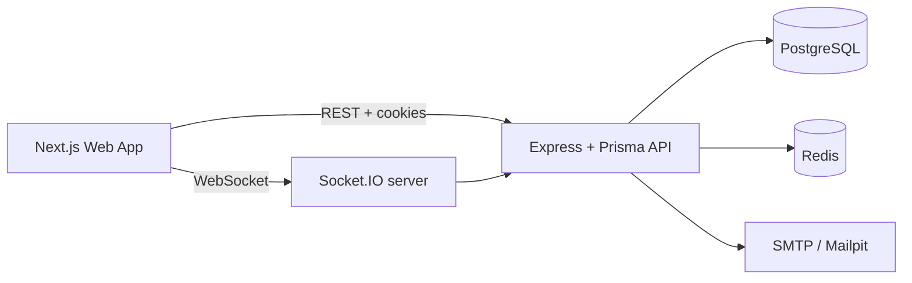

# Design notes

This document captures the design decisions, operational constraints, and trade-offs that drive the workspace app implementation.

## Overview

The project is a multi-tenant collaborative workspace service built around a PostgreSQL-backed API and a Next.js frontend. It models workspaces, memberships, boards, lists, tasks, labels, activity, invites, and real-time updates while enforcing workspace-level tenant isolation and a role-based access matrix.

The implementation follows the roadmap in `ROADMAP.md` and favours correctness and clear tenancy boundaries over broad feature count. This is intentional: the app is designed to be reliable under concurrent board edits, cross-tenant access attempts, and degraded Redis/DB conditions.

## Architecture

### Components

- Web app: Next.js App Router with route-level workspace shell, auth provider, React Query cache, and board UI.
- API: Express 5 service with auth middleware, RBAC enforcement, Prisma database operations, and activity/event publication.
- Realtime layer: Socket.IO server attached to the same HTTP server as the REST app and joined by authenticated workspace/board rooms.
- Cache/queue: Redis-backed cache-aside helpers and BullMQ-ready queue scaffolding with graceful degradation.
- Persistence: PostgreSQL with Prisma migrations and fractional ordering for list/task positions.

## Authentication and authorization

### Auth strategy

- Access token: JWT signed with a short TTL and stored in memory in the web app.
- Refresh token: random opaque token stored hashed in PostgreSQL and rotated on each refresh.
- Cookie: refresh token is stored in an `HttpOnly` cookie on the API origin; the browser sends it only for auth requests.
- Reuse detection: refresh-token family invalidation prevents replayed tokens from continuing to work after a token leak or replay.
- The access token is intentionally not persisted to local storage to reduce XSS exposure.

### Authorization model

The app uses a workspace-scoped role matrix: `OWNER`, `ADMIN`, `MEMBER`, and `VIEWER`. The request flow is:

1. `authenticate` resolves the current user from the access token.
2. `requireWorkspaceMember` loads the user’s membership in the target workspace.
3. `requirePermission('...')` enforces the workspace permission matrix.
4. Domain handlers perform tenant-aware database queries using `workspaceId` in every `where`.

The web app also respects `useRole()` for rendering read-only states, but the API remains the source of truth for security.

## Data model summary

The canonical schema models:

- `User` and `Membership` for authentication and workspace access.
- `Workspace`, `Board`, `List`, and `Task` for the board domain.
- `Label` and `TaskLabel` for task tagging.
- `Invitation` and `RefreshToken` for invites and session rotation.
- `ActivityLog` for workspace event history.

The Prisma schema is the source of truth and is defined in `apps/api/prisma/schema.prisma`.

## Ordering and concurrency

Board positions use fractional indexing so ordering remains stable while lists and tasks move. This avoids duplicate indexes during frequent edits and makes reordering resilient across multiple clients.

Critical rules:

- task/list positions are stored as strings rather than integers
- the API validates optimistic version numbers on task mutations
- `afterTaskId` is used to place a task relative to another task in a list
- list and task update endpoints reject stale writes with `409` conflicts and require a refresh and re-apply flow in the UI

This approach balances simple API semantics with predictable ordering when users move items concurrently.

## Realtime design

The Socket.IO server is attached to the same HTTP server instance as the API. Clients join `workspace:*` and `board:*` rooms after authentication.

Domain events are published only after successful DB commit. This ensures the UI never receives a realtime event for a rolled-back or invalid write.

When a socket reconnects, the board page refetches the snapshot so stale state cannot linger after a brief connectivity drop.

## Cache and queue choices

### Cache

The API uses Redis-backed cache-aside for workspace dashboard data. This reduces repeated expensive dashboard aggregation queries while remaining resilient to Redis outages.

### Queue

BullMQ is set up for background work such as digest or email-style jobs. The queue layer is intentionally fail-open: a Redis outage does not crash the main API request flow.

## Failure handling

- Redis errors are logged and downgraded to fallback behavior rather than a crash.
- Database and Redis health checks are exposed at `/health` and `/health/ready`.
- The app does not expose stack traces in production.
- Socket events are made idempotent in the UI and re-sync after reconnects.

## Testing strategy

The project uses:

- Vitest for unit and integration tests
- Supertest for HTTP checks
- Socket.IO client tests for realtime validation
- Postgres-backed local integration tests with `TEST_DATABASE_URL`

Key validation areas include:

- ordering and task placement logic
- auth and refresh rotation behavior
- workspace RBAC enforcement
- board list/task lifecycle behavior
- activity and search queries
- dashboard cache degrade-safe behavior
- realtime join and broadcast flows

## Trade-offs and known limitations

- Ownership transfer is not implemented; a workspace owner cannot be transferred automatically.
- Presence indicators are intentionally deferred; it is not yet included in the roadmap scope.
- Search uses offset-style pagination rather than cursor-based pagination for the front-end flow.
- Socket authentication is based on the current access token and does not enforce a separate server-side live-session refresh beyond expiry.
- Invite email delivery depends on SMTP configuration and a working mail provider.
- The app is optimized for correctness and strict isolation, not for a large multi-tenant scale-out design.

## What I would do next

1. Final production deployment to Render + Vercel with real secrets.
2. Seed the production database from a safe `ALLOW_SEED=true` run.
3. Add a cleaner task detail drawer and richer board conflict-resolution UI.
4. Expand CI coverage and smoke tests for browser-level flows.
5. Add presence, CSV export, and per-user rate limiting only after the above are stable.
